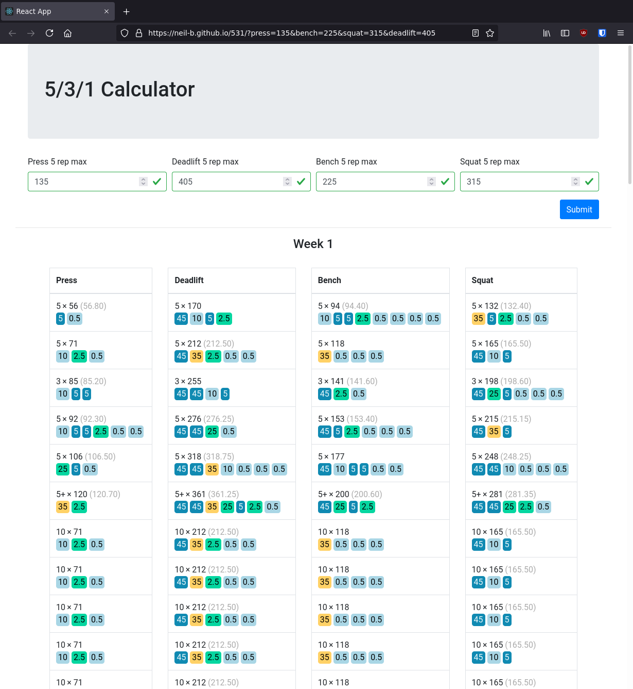

# 531 routine planner
## [View the calculator](https://neil-b.github.io/531/)

A calculator for planning [5/3/1 lifting routines](https://thefitness.wiki/routines/5-3-1-for-beginners/) (and an excuse to learn React).

### Features
- Color coded plates
- URL query string support

